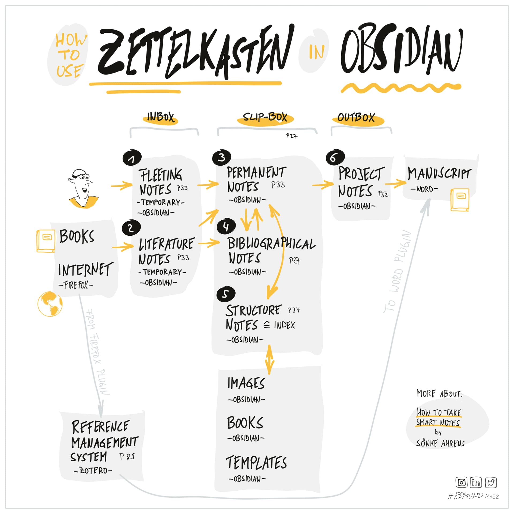

- Noises in the attic :household:
	- [Palm Harbor FL Pest Control, Wildlife Management & Termites](https://palmharbortermiteandpestcontrol.com/)
	  tags:: [[household]]
	- [Palm Harbor Pest Control & Termite Control | Get a Free Pest Inspection!](https://www.masseyservices.com/service-location/palm-harbor-pest-control/)
	  tags:: [[household]]
- [/pages/Danish-Swedish-bridge](/pages/Danish-Swedish-bridge) -- logseq link [[Danish-Swedish-bridge]]
- note found in "Zettel Notes" re. advantage. I've never really tried to follow the formula with some strictness. https://obsidian.rocks/getting-started-with-zettelkasten-in-obsidian/ :notetaking:
	- *This is italic*
	- https://github.com/groepl/Obsidian-Templates
	- https://forum.obsidian.md/t/obsidian-zettelkasten-starter-kit/51090
	- https://forum.obsidian.md/t/provide-structure-how-do-you-use-zettelkasten-in-obsidian/35008
	- 
- Bicycle trainer: :health: 
  - [[Mary Pat]] suggested this as an alternative to what I had been thinking to expand my options for exercise / cardio
  - https://www.bicycling.com/bikes-gear/a20050631/how-to-choose-an-indoor-bike-trainer/ expensive options
  - kinds resistance mechanism 
    - magnetic: e.g. [https://www.amazon.com/Alpcour-Bike-Trainer-Stand-Quick-Release/](https://www.amazon.com/Alpcour-Bike-Trainer-Stand-Quick-Release/dp/B07PYHLTSX/ref=sxin_17_pa_sp_search_thematic_sspa?c=ts&content-id=amzn1.sym.2da95b6c-f59a-4699-bc43-d0ff036c6388%3Aamzn1.sym.2da95b6c-f59a-4699-bc43-d0ff036c6388&cv_ct_cx=Bike+Trainers+%26+Accessories&keywords=Bike+Trainers+%26+Accessories&pd_rd_i=B07PYHLTSX&pd_rd_r=a5695c4c-746e-4a20-b355-d69885c64a7b&pd_rd_w=74xHT&pd_rd_wg=aSvxz&pf_rd_p=2da95b6c-f59a-4699-bc43-d0ff036c6388&pf_rd_r=2WGZWRKA9JPMMWZ82GNJ&qid=1751157638&s=outdoor-recreation&sbo=RZvfv%2F%2FHxDF%2BO5021pAnSA%3D%3D&sr=1-3-6024b2a3-78e4-4fed-8fed-e1613be3bcce-spons&ts_id=6389526011&sp_csd=d2lkZ2V0TmFtZT1zcF9zZWFyY2hfdGhlbWF0aWM&psc=1)
    - fluid: e.g. [https://www.amazon.com/Saris-CycleOps-Fluid2-Indoor-Trainer](https://www.amazon.com/Saris-CycleOps-Fluid2-Indoor-Trainer/dp/B07WP6JRSQ/ref=sr_1_18?c=ts&dib=eyJ2IjoiMSJ9.Yhgsbiqwd03UxQBGXq4TtcODJTFylBz4beQKGOVEMhbJPmIt3mbGMC3OuIzdQMxLik7KVnjbjxNzR1d2JahAvb0liqEkkXdPcLgX8CmeMIiQb2OYEjsDMXhvGv9Kmgm969I7_OKF7_zjplf3JYavVrmh_kFPPNIzoFP-xRbvkAUtM0655Gg5ZoxWaHw-maffn4M21OZrmBgOKL4_BCbeR7_nXV4yxEk2WU6hXJGBQskiyAQcL5Bnr0ICb8SbvloYBP_4SfP5vx-RIdrjLeEDHFP-aYr5DAfqWm05Ck_3c9E.3ktfvfklgUDCUbtosm-OgPi1V1wh4OczuhXDYQJietE&dib_tag=se&keywords=Bike%2BTrainers%2B%26%2BAccessories&qid=1751157638&s=outdoor-recreation&sr=1-18&ts_id=6389526011&th=1)
    - friction?
    - 3 types: wheel-on, direct-drive, rollers
  - accessories
    - riser for front wheel
    - mat beneath the whole
  - REI guide to buying: [https://www.rei.com/learn/expert-advice/indoor-bike-trainers.html](https://www.rei.com/learn/expert-advice/indoor-bike-trainers.html)
    - check all the specs:
      - incl. mtn. bike
      - wheel size
      - rear axle

