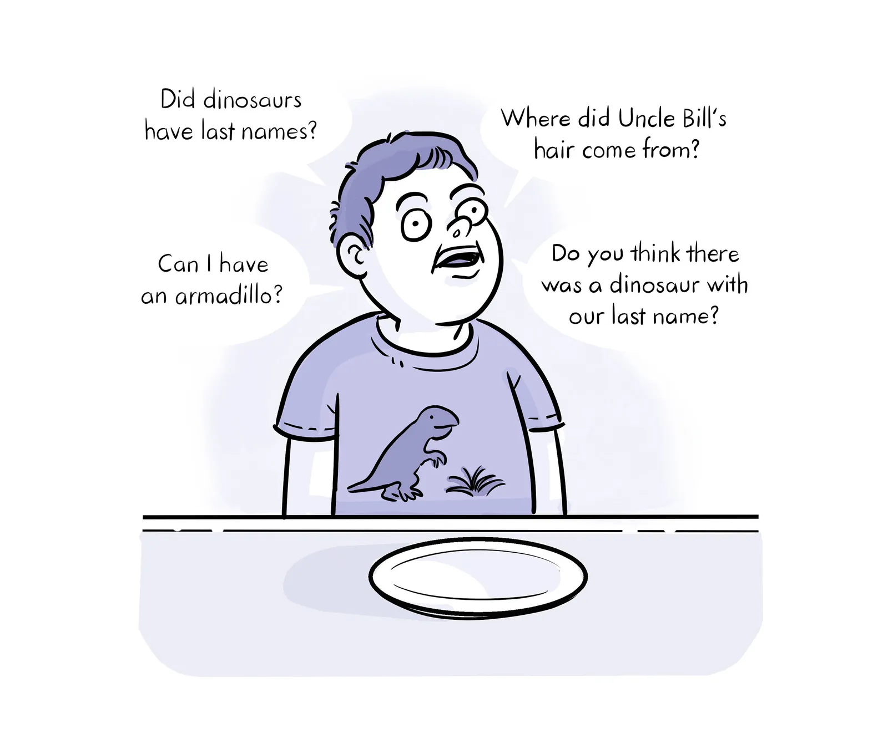
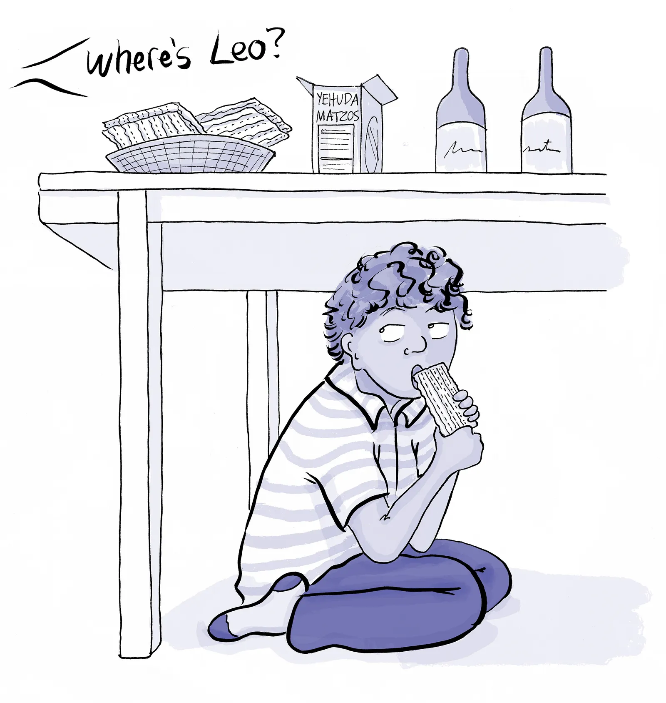

- **08:19** [[quick capture]]:  [A Few More Questions for This Seder | The New Yorker](https://www.newyorker.com/humor/daily-shouts/a-few-more-questions-for-this-seder)
- **08:30** [[quick capture]]:  [The Other Children of Passover | The New Yorker](https://www.newyorker.com/humor/daily-shouts/the-other-children-of-passover?utm_source=nl&utm_brand=tny&utm_mailing=TNY_Humor_042224&utm_campaign=aud-dev&utm_medium=email&bxid=5be9e91324c17c6adf030df0&cndid=31901235&esrc=bounceX&utm_term=TNY_Humor)
  collapsed:: true
	- 
	- 
	- 
	- 
	- **08:32** [[quick capture]]: 
	- **08:32** [[quick capture]]: 
	- 
	- 
	-
- **09:28** [[quick capture]]:  [A Special Seder | The New Yorker](https://www.newyorker.com/magazine/2016/04/25/a-special-seder?utm_source=nl&utm_brand=tny&utm_mailing=TNY_Humor_042224&utm_campaign=aud-dev&utm_medium=email&bxid=5be9e91324c17c6adf030df0&cndid=31901235&esrc=bounceX&utm_term=TNY_Humor)
- **10:50** [[quick capture]]:  [Opinion: Right now, I’d rather raise my child in Taiwan than America | CNN](https://www.cnn.com/2024/04/22/opinions/taiwan-view-2024-us-election-wei/index.html)
- **12:21** [[quick capture]]:  [How to clean Arch Linux | Average Linux User](https://averagelinuxuser.com/clean-arch-linux/)
	- I really need to do this with my beelink
-